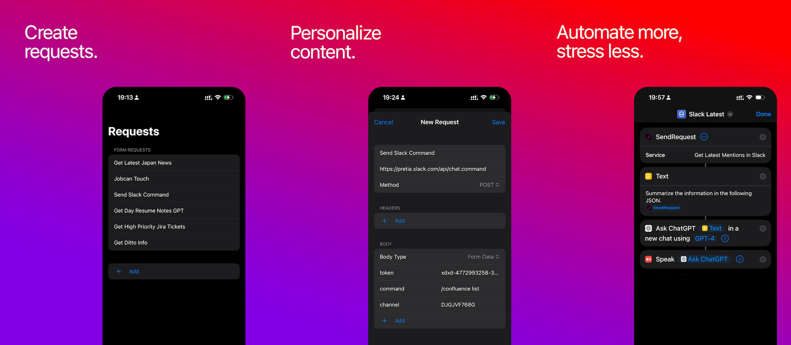

# Bypass API


[](https://apps.apple.com/app/bypass-api/id6449934061)

[](https://www.paypal.com/donate/?hosted_button_id=QY4PCGA8FMCC4)


Bypass API is an innovative app designed to facilitate the creation and usage of editable requests directly from Apple's Shortcuts app. It incorporates a user-friendly request set up, enabling users to send requests and receive information with ease.

## Features

- **Zero input send request method**: Send requests and receive responses through the Shortcuts app.
- **Body content flexibility**: Supports two types (JSON and Multi-Form).
- **Customizable headers and method types**: Modify your requests to your specific needs.



## Usage

Bypass API is user-friendly and easy to navigate. Here's how you can make the most out of it:

1. Open the app and press the 'Add' button on the main menu to create a new request.
2. Assign a name to your request. This name will serve as its unique identifier.
3. Insert a valid URL from an API. If no URL is input, the request won't be created. For initial trials, you can use a public API such as the listed in the [Public APIs Project](https://github.com/public-apis/public-apis).
4. Specify additional details for your request, such as the HTTP method, headers, and body type. Please note that only JSON and Multi Form types are currently supported.
5. Open the Apple Shortcuts app and create a new shortcut.
6. From the 'Actions' menu, choose the actions related to Bypass API and select 'SendRequest'.
7. Input the name of the request you wish to run.
8. Press 'Run'. A text response will be displayed containing the results of your request.

## Requirements

- Xcode 14.2+
- iOS 16.5+
- Shortcuts App installed.

Note: An account enrolled to the Apple Developer program is required. This project uses App Groups to exchange information between the Bypass API app and the Shortcuts app.

## Installation

1. Clone the repository:

```bash
git clone https://github.com/javier-games/bypass-api.git
```

2. Open the project in Xcode:

```bash
open "Bypass API.xcodeproj"
```

3. Assign a new bundle ID and profile if you're not a member of the current team.

4. Make sure you have App Groups enabled.
5. Analyze and build the project.

## License

Bypass API is available under the MIT license. See the [LICENSE](LICENSE) file for more info.

## Contribution

Please read our [Contributing Guide](CONTRIBUTING.md) before submitting a Pull Request to the project.

## Support

For any questions or issues, please open a [new issue](https://github.com/javier-games/bypass-api/issues/new) on this repository.

## Donations

Bypass API is a free project, and it's because of your support that we can stay up and running. If you find this project useful, please consider [making a donation](https://www.paypal.com/donate/?hosted_button_id=QY4PCGA8FMCC4). Your contribution will help us pay for the Apple Developer license, maintain the project, and continue to develop new features. We appreciate your generosity!
